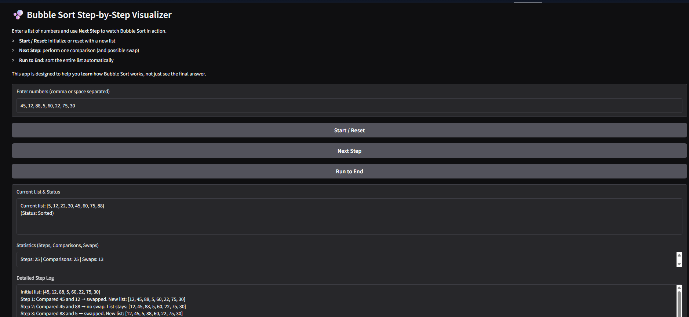
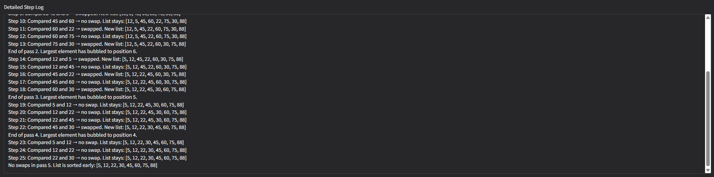

# Bubble Sort Step-by-Step Visualizer
---
title: Bubble Sort Visualizer
emoji: {{emoji}}
colorFrom: {{colorFrom}}
colorTo: {{colorTo}}
sdk: {{sdk}}
sdk_version: "{{sdkVersion}}"
app_file: app.py
pinned: false


## Problem Breakdown & Computational Thinking

### 1. Decomposition

The project is broken into smaller parts:

- **Input handling**  
  - Read a string of numbers from the user.  
  - Parse into a Python list of integers.  
  - Handle invalid input.

- **Bubble Sort algorithm**  
  - Perform comparisons between elements.  
  - Swap elements if they are out of order.  
  - Repeat passes until the list is sorted or no swaps occur in a pass.

- **Step-by-step simulation**  
  - Maintain a **state**: current array, current pass `i`, current index `j`, step count, comparisons, swaps.  
  - Each press of **“Next Step”** performs exactly **one** comparison (and possible swap).  
  - Log every step with a human-readable explanation.

- **User Interface**  
  - Text input for numbers.  
  - Buttons: **Start / Reset**, **Next Step**, **Run to End**.  
  - Output areas: current list + status, statistics, and detailed log.

- **Deployment**  
  - Package with `gradio` as the UI library.  
  - Run locally and on Hugging Face Spaces.

---

### 2. Pattern Recognition

Bubble Sort follows a repeated pattern:

- Compare element at index `j` with element at index `j + 1`.
- If `arr[j] > arr[j + 1]`, swap them.
- Move `j` from `0` to `n - 2 - i` for each pass `i`.
- After each full pass, the largest remaining element has “bubbled” to the end of the unsorted region.
- If a full pass completes with **no swaps**, the list is already sorted.

The app uses this pattern in a **loop**, but exposes each comparison as a **single step** to the user.

---

### 3. Abstraction

Abstractions used:

- The user only sees:
  - The **current list**,
  - Which pass and indices are being processed,
  - Whether a swap happened,
  - A summary of steps, comparisons, and swaps.

- Internal details abstracted away:
  - Data structures like the internal `state` dictionary.
  - Loop mechanics for passes and indices.
  - Early termination logic (no swaps → sorted).

This makes the algorithm easier to understand without overwhelming the user with code.

---

### 4. Algorithm Design

**Input → Processing → Output**

1. **Input**
   - User types a sequence of integers (comma or space separated).
   - Example: `45, 12, 88, 5, 60, 22, 75, 30`.

2. **Processing (Bubble Sort with simulation)**
   - `init_state`:
     - Parses the input.
     - Stores a state dictionary:
       - `array`, `n`, `i`, `j`, `step`, `comparisons`, `swaps`,
         `swapped_this_pass`, `finished`, and a `log`.
   - `bubble_step`:
     - Uses the state to perform **one** comparison (and possible swap).
     - Updates indexes, counters, and log.
     - Detects end of pass and early finish if no swaps.
   - `bubble_run_to_end`:
     - Calls `bubble_step` repeatedly until sorted.

3. **Output**
   - Current list and status (sorted / in progress).
   - Pass number and indices being compared.
   - Total steps, comparisons, swaps.
   - A detailed textual log of all actions taken.

---

## Algorithm Implementation

**Algorithm name:** Bubble Sort  
**Goal:** Sort a list of integers in ascending order.

---
## Demo Screenshot / GIF




---

### Pseudocode

```text
repeat
    swapped = false
    for j from 0 to n - 2 - i
        if arr[j] > arr[j + 1]
            swap arr[j], arr[j + 1]
            swapped = true
    if not swapped
        break  // list is already sorted
    i = i + 1
until i >= n - 1
